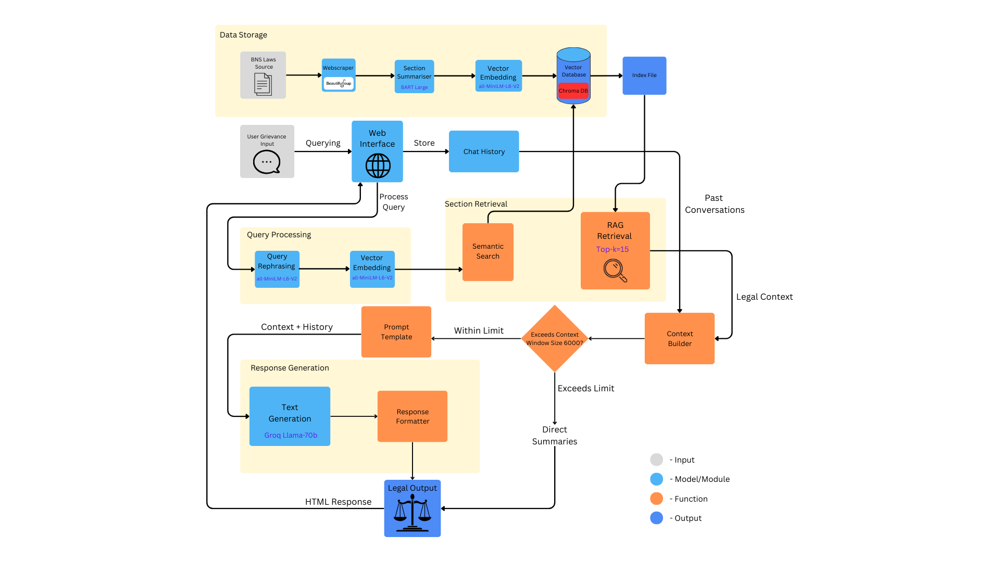

# Legal AEye-Opener 👁️ ⚖️

An AI-powered legal advisory chatbot that provides intelligent guidance on Indian laws based on the **Bharatiya Nyaya Sanhita (BNS)** legal code. Get instant access to legal information, section summaries, and AI-generated responses to your legal queries.



---

## 📋 Table of Contents

- [Overview]
- [Key Features]
- [Tech Stack]
- [Architecture]
- [Installation]
- [Usage]
- [How It Works]
- [API Configuration]
- [Project Structure]
- [Contributing]
- [License]

---

## 🎯 Overview

Legal AEye-Opener is an intelligent legal assistant designed to help users understand their legal rights and navigate the Indian legal system. The application uses advanced AI technologies to:

- **Search and retrieve** specific BNS sections by number or range
- **Understand natural language queries** about legal matters
- **Generate contextual responses** using AI (Groq LLM)
- **Maintain conversation history** for contextual follow-ups
- **Provide source citations** for transparency

The system replaces references to the outdated Indian Penal Code (IPC) with the new Bharatiya Nyaya Sanhita (BNS), ensuring users receive up-to-date legal information.

---

## ✨ Key Features

### 🔍 Intelligent Query Processing
- **Exact Section Matching**: Retrieve specific BNS sections (e.g., "Section 302", "Sections 120, 121, 122")
- **Range Queries**: Search multiple sections at once (e.g., "Sections 100 to 105", "from section 50 to section 60")
- **Natural Language Understanding**: Ask questions in plain English (e.g., "What is the punishment for theft?")
- **Query Rephrasing**: Automatically improves vague queries for better results

### 🤖 AI-Powered Responses
- **Contextual Answers**: Groq LLM generates comprehensive, context-aware responses
- **Conversation Memory**: Maintains chat history for follow-up questions
- **Smart Fallbacks**: Uses semantic search when exact matches aren't found
- **Source Attribution**: Links to original legal documents for verification

### 💬 User-Friendly Interface
- **Chat-Based Interface**: Intuitive conversation flow with message history
- **Markdown Support**: Formatted responses with proper styling
- **Clear Result Types**: Visual badges indicate match types (Exact, Generated, Semantic, Error)
- **Session Persistence**: Chat history preserved during browsing session

### 🗄️ Robust Data Management
- **ChromaDB Vector Database**: Fast semantic search capabilities
- **FAISS Index**: Backup indexing for efficient retrieval
- **Sentence Transformers**: High-quality text embeddings
- **Automated Scraping**: Updates legal database from official sources

---

## 🛠️ Tech Stack

### Backend
- **Flask**: Web framework for Python
- **LangChain**: LLM orchestration and prompt management
- **Groq API**: Fast LLM inference with Llama 3 70B model
- **ChromaDB**: Vector database for semantic search
- **FAISS**: Facebook AI Similarity Search for efficient indexing

### AI/ML Libraries
- **Sentence Transformers**: `all-MiniLM-L6-v2` for text embeddings
- **Transformers**: BART model for text summarization
- **BeautifulSoup4**: Web scraping legal documents

### Frontend
- **HTML5/CSS3**: Clean, responsive user interface
- **JavaScript**: Client-side interactivity
- **Markdown**: Formatted text rendering

---

## 🏗️ Architecture

### System Components

1. **Web Scraper** (`update_chromadb.py`)
   - Scrapes BNS laws from devgan.in
   - Extracts sections, chapters, and content
   - Generates summaries using BART
   - Stores in ChromaDB with metadata

2. **Flask Application** (`app.py`)
   - Handles user requests and routing
   - Processes queries (exact matching, ranges, semantic search)
   - Manages conversation history via sessions
   - Integrates with Groq LLM for AI responses

3. **Custom LLM Wrapper** (`groq_llm.py`)
   - LangChain-compatible Groq interface
   - Configurable temperature and model selection
   - Error handling for API calls

4. **Vector Database** (ChromaDB)
   - Stores 358 BNS sections with embeddings
   - Enables fast semantic similarity search
   - Maintains metadata (section numbers, titles, URLs)

### Data Flow

```
User Query → Flask App → Query Parser
                ↓
        ┌───────┴────────┐
        ↓                ↓
    Exact Match    Semantic Search
    (Regex)        (ChromaDB)
        ↓                ↓
    BNS Sections   Top-K Results
        ↓                ↓
        └───────┬────────┘
                ↓
         Groq LLM (Context + Query)
                ↓
         AI-Generated Response
                ↓
         Rendered to User
```

---

## 📦 Installation

### Prerequisites
- Python 3.8+
- pip package manager
- Internet connection (for initial data scraping)

### Step 1: Clone the Repository
```bash
git clone https://github.com/yourusername/legal-aeye-opener.git
cd legal-aeye-opener
```

### Step 2: Install Dependencies
```bash
pip install -r requirements.txt
```

**Required packages:**
```
flask
sentence-transformers
chromadb
langchain
langchain-core
groq
beautifulsoup4
requests
faiss-cpu
transformers
markdown
```

### Step 3: Set Up Groq API Key
Replace the placeholder API key in `app.py` and `groq_llm.py` with your own:

```python
groq_api_key = os.getenv("GROQ_API_KEY", "your_groq_api_key_here")
```

Or set as environment variable:
```bash
export GROQ_API_KEY="your_groq_api_key_here"
```

Get your free API key at: [https://console.groq.com](https://console.groq.com)

### Step 4: Build the Database (First Time Only)
```bash
python update_chromadb.py
```

This will:
- Scrape all BNS sections from devgan.in
- Generate summaries for each section
- Create ChromaDB collection with embeddings
- Save backup JSON and FAISS index

**Note:** This process takes 10-15 minutes and only needs to be run once (or when updating the database).

---

## 🚀 Usage

### Starting the Application
```bash
python app.py
```

The server will start at `http://127.0.0.1:5000`

### Query Examples

#### 1. Exact Section Lookup
```
User: "What is Section 302?"
Bot: [Returns Section 302 details about murder with AI explanation]
```

#### 2. Multiple Sections
```
User: "Show me sections 120, 121, and 122"
Bot: [Returns all three sections with explanations]
```

#### 3. Range Queries
```
User: "Sections from 100 to 105"
Bot: [Returns sections 100-105 with consolidated AI summary]
```

#### 4. Natural Language Queries
```
User: "What is the punishment for theft in India?"
Bot: [Searches semantically, finds relevant sections, generates AI answer]
```

#### 5. Conversational Follow-ups
```
User: "Tell me about murder laws"
Bot: [Provides information about murder sections]

User: "What about attempted murder?"
Bot: [Uses conversation context to provide relevant answer]
```

### Special Features

- **Invalid Section Detection**: Warns if section numbers are out of range (1-358)
- **Token Limit Handling**: Skips Groq for very large contexts to avoid errors
- **Clear Chat**: Reset conversation history with the "Clear" button
- **Debug Mode**: Visit `/debug` to view all stored ChromaDB records

---

## 🔧 How It Works

### Query Processing Pipeline

1. **Input Normalization**
   - Converts "till section X from section Y" to standard range format
   - Extracts section numbers using regex patterns

2. **Section Extraction**
   - Combined ranges: `from section 10 to section 20`
   - Simple ranges: `100-105`, `50 to 60`
   - Lists: `section 120, 121, and 122`
   - Validates against BNS section range (1-358)

3. **Retrieval Strategy**
   - **Exact Match**: If section numbers found, fetch directly from ChromaDB
   - **Semantic Search**: If no numbers, use query rephrasing + embedding similarity
   - **Hybrid**: Combines exact matches with AI synthesis

4. **AI Response Generation**
   - Constructs context from retrieved sections
   - Includes last 5 conversation turns for continuity
   - Uses Groq's Llama 3 70B model for intelligent responses
   - Adds source citations when using semantic search

5. **Result Formatting**
   - Markdown rendering for rich text
   - Badge indicators for result types
   - Source links for transparency
   - Timestamp tracking

---

## 🔑 API Configuration

### Groq LLM Settings

Located in `groq_llm.py`:

```python
class GroqLLM(LLM):
    model: str = "llama3-70b-8192"  # Model selection
    temperature: float = 0.7         # Creativity (0.0-1.0)
    groq_api_key: str = "your_key"   # API authentication
```

**Available Models:**
- `llama3-70b-8192`: Best quality, slower (default)
- `llama3-8b-8192`: Faster, lower quality
- `mixtral-8x7b-32768`: Alternative high-quality option

**Temperature Guide:**
- `0.0-0.3`: Factual, deterministic responses
- `0.4-0.7`: Balanced creativity (recommended for legal)
- `0.8-1.0`: Creative, varied responses

### ChromaDB Configuration

Located in `update_chromadb.py`:

```python
CHROMA_DB_PATH = "./chroma_db"          # Database location
COLLECTION_NAME = "bns_laws"            # Collection identifier
BASE_URL = "https://devgan.in"          # Legal source
LAW_TYPE = "bns"                        # Legal code type
```

### Embedding Model

Using `all-MiniLM-L6-v2`:
- Dimension: 384
- Speed: Fast
- Quality: Good for legal text
- Multilingual: Yes (limited)

---

## 📁 Project Structure

```
legal-aeye-opener/
│
├── app.py                      # Main Flask application
├── update_chromadb.py          # Database scraper/updater
├── requirements.txt            # Python dependencies
├── README.md                   # Project documentation
│
├── llms/
│   └── groq_llm.py            # Custom Groq LangChain wrapper
│
├── templates/
│   ├── index.html             # Main chat interface
│   └── debug.html             # Database inspection page
│
├── chroma_db/                 # ChromaDB persistent storage
│   └── [database files]
│
├── Legal_AEye-Opener/         # Output directory
│   ├── bns_laws_data.json    # Complete BNS data backup
│   └── bns_faiss.index       # FAISS index backup
│
└── LegalAEye_Architecture.png # System architecture diagram
```

---

## 🤝 Contributing

We welcome contributions! Here's how you can help:

### Bug Reports
- Use GitHub Issues to report bugs
- Include error messages and reproduction steps
- Mention your Python version and OS

### Feature Requests
- Suggest new features via GitHub Issues
- Explain use cases and benefits
- Check existing issues to avoid duplicates

### Pull Requests
1. Fork the repository
2. Create a feature branch (`git checkout -b feature/amazing-feature`)
3. Commit your changes (`git commit -m 'Add amazing feature'`)
4. Push to the branch (`git push origin feature/amazing-feature`)
5. Open a Pull Request

### Development Guidelines
- Follow PEP 8 style guide
- Add comments for complex logic
- Test thoroughly before submitting
- Update documentation for new features

---

## 🚧 Future Enhancements

- [ ] Support for additional Indian legal codes (IPC, CrPC, Evidence Act)
- [ ] Multi-language support (Hindi, regional languages)
- [ ] User authentication and personalized history
- [ ] Export chat conversations as PDF
- [ ] Voice input/output capabilities
- [ ] Mobile application (iOS/Android)
- [ ] Case law integration and precedent analysis
- [ ] Lawyer directory and consultation booking
- [ ] Legal document generation tools

---

## ⚠️ Disclaimer

**Legal AEye-Opener is an informational tool only.** 

- This application provides general legal information based on the BNS code
- It is **NOT a substitute** for professional legal advice
- Always consult a qualified lawyer for specific legal matters
- The creators are not responsible for actions taken based on this information
- Legal codes may be updated; verify information with official sources

---


## 📄 License

This project is licensed under the MIT License - see the [LICENSE](LICENSE) file for details.

---

## 🙏 Acknowledgments

- **Devgan.in** for providing comprehensive BNS legal documents
- **Groq** for fast LLM inference capabilities
- **ChromaDB** for efficient vector database solutions
- **Hugging Face** for transformer models and sentence embeddings
- All contributors and users of this project

---

## 📚 Resources

- [BNS Laws Source](https://devgan.in/bns/)
- [Groq Documentation](https://console.groq.com/docs)
- [ChromaDB Docs](https://docs.trychroma.com/)
- [LangChain Guide](https://python.langchain.com/docs/get_started/introduction)
- [Sentence Transformers](https://www.sbert.net/)

---

**Made with ❤️ for access to justice in India**

*Legal AEye-Opener - Opening eyes to legal rights, one query at a time.*
